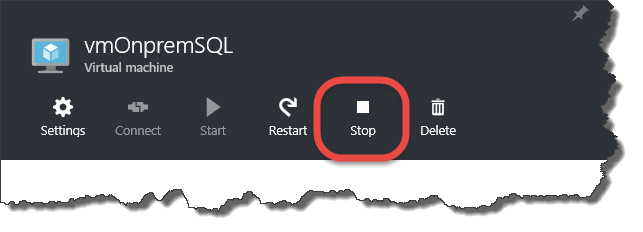
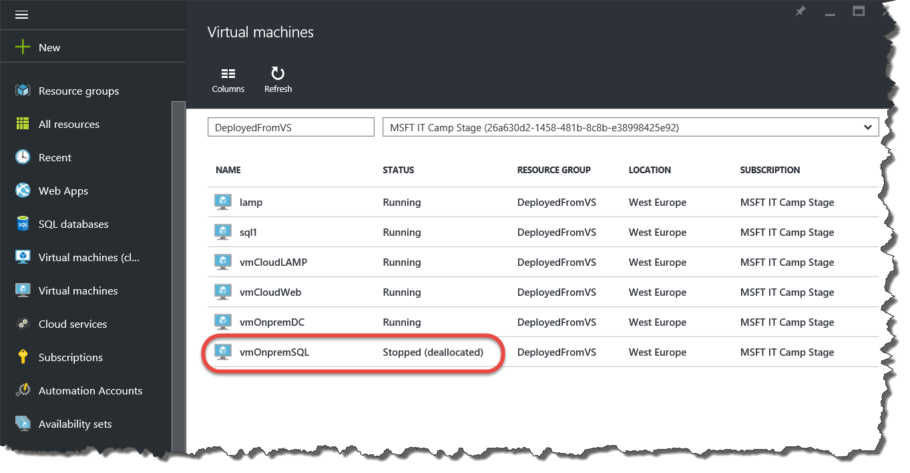

# Abschluss

* Herunterfahren der Umgebung
* Weiterverwendung nach dem Camp
* Fragerunde

## Bevor Sie gehen: VMs herunterfahren

Fahren Sie Ihre Umgebung herunter, um Guthaben auf Ihrem Azure Pass zu sparen.

Dazu müssen Sie im Portal Ihre erstellten VMs jeweils öffnen und auf Stop (Beenden) klicken. 

Nur im Zustand "Stopped (deallocated)" [Beendet (Zuordnung aufgehoben)] verursachen VMs keine Kosten. Der Zustand "Stopped" ("Beendet") reicht nicht aus, 
da in diesem Fall immer noch Ressourcen für die VM in Azure reserviert werden.

